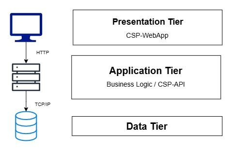
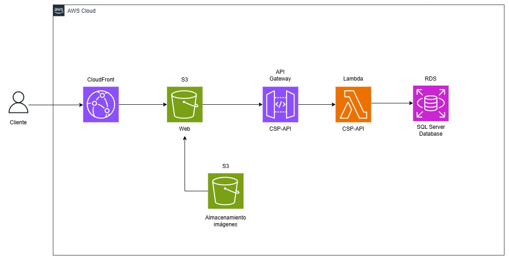

# Descripción general

El proyecto **"Club Social Progreso"** es una página web desarrollada para brindar una presencia digital al club, el cual hasta ahora carecía de una plataforma propia. La idea surgió de la necesidad de contar con un espacio donde se pueda recopilar información relevante sobre el club y difundir las últimas noticias y eventos.

Este proyecto no solo pone en práctica diversas tecnologías con las que me he sentido cómodo, sino que también cumple el objetivo de dotar al club social de una herramienta digital para mejorar la comunicación y la difusión de sus actividades.

# Tecnologías y Herramientas

**Frontend:**

 (versión 18)   
 

**Backend/API:**

  

**Base de datos:**

**Despliegue en la nube:**

En la sección [Infraestructura en la nube](#infraestructura-en-la-nube) se detallan los servicios en especifico y se brinda un diagrama de la infraestructura 

(<a href="#readme-top">Volver al inicio</a>)

# Arquitectura de la aplicación

Esta aplicación sigue el modelo de **Arquitectura de Tres Niveles** (Three-Tier Architecture), que divide el sistema en tres capas principales para mejorar la modularidad, escalabilidad y mantenimiento.

Uno de los principales beneficios de la **modularidad** fue la posibilidad de desplegar cada componente de forma independiente. La capa de presentación y aplicación fueron alojadas en servicios proporcionados por AWS y la capa de datos en Azure, siendo todo el sistema totalmente funcional y compatible entre si.

En cuanto al **mantenimiento**, este se ve mejorado porque cada capa tiene una única responsabilidad, lo que facilita la depuración y actualización sin impactar a todo el sistema. Un ejemplo de esto fue el cambio de utilizar una base de datos en Amazon RDS a datos fijos, lo que solo requirió cambiar pocas líneas de código dentro de la capa de aplicación, sin la necesidad de realizar cambios en otros componentes.

A continuación se presenta un diagrama de dichas capas:

**Presentation Tier**   
La capa de presentación se compone de la interfaz de usuario de la aplicación, desarrollada utilizando Angular versión 18. Su principal función es mostrar información general sobre el Club Social Progreso y las noticias más recientes.

**Application Tier**   
La capa de aplicación es la encargada de procesar la información recolectada en la capa de presentación utilizando la lógica de nogocio. La capa de aplicación también puede agregar, eliminar o modificar la información de la capa de datos. En este caso fue desarrollada utilizando .NET 8.0 y C#, y se comunica con la capa de datos utilizando llamadas a la API REST. 

**Data Tier**   
La capa de datos es donde la información se almacena y es gestionada. En este caso, consiste de una base de datos relacional con un motor SQL Server.

(<a href="#readme-top">Volver al inicio</a>)

# Documentación de la API

La API REST fue desarrollada con .NET Core 8.0, para una descripción más profunda sobre los endpoints visitar el [README del proyecto en github](https://github.com/JuanAndresMacedo/Club-Social-Progreso-API).

(<a href="#readme-top">Volver al inicio</a>)

# Infraestructura en la nube

La infraestructura diseñada para la página web del Club Social Progreso sigue una arquitectura de microservicios en la nube, que permite escalabilidad, alta disponibilidad y una administración eficiente de los recursos. A continuación, se muestra un diagrama simple de la infraestructura y se detalla cada componente y su interacción dentro de la misma:

### Amazon S3
Se utiliza un bucket **S3** para almacenar los archivos estáticos de la página web, como HTML, CSS y JavaScript, permitiendo una distribución eficiente a través de CloudFront.

Se utiliza un bucket **S3** para almacenar las fotos que van a ser utilizadas en la web. En la base de datos se almacenan las rutas de dichas imagenes que luego serán accedidas por el frontend.

### Amazon CloudFront
Se utiliza **Amazon CloudFront** para distribuir los archivos almacenados en S3 de manera rápida y segura, reduciendo la latencia para los usuarios finales. Al utilizar una red de entrega de contenido (CDN), se almacenan copias en caché en ubicaciones geográficas cercanas a los usuarios, optimizando el rendimiento y reduciendo la carga sobre el bucket S3 principal.

### API Gateway / Lambda
**API Gateway** actúa como el punto de entrada para las solicitudes a la API REST, proporcionando seguridad, control de acceso y gestión de tráfico. Mientras que **AWS Lambda** se encarga de procesar las solicitudes recibidas desde API Gateway, ejecutando la lógica de negocio y conectándose con la base de datos cuando es necesario.

### RDS
Para el almacenamiento de datos, en un primer lugar se implementó una base de datos SQL Server en **Amazon RDS**. Con el paso de los días el, mantenimiento de esta base de datos incurrió en costos, por lo que se decidió darla de baja para pasar a un conjunto de datos fijos. De todas formas, se logró utilizar el servicio RDS de forma exitosa.

(<a href="#readme-top">Volver al inicio</a>)

## Contacto

Juan Andrés Macedo - juanmacedo2003@hotmail.com

Linkedin: [https://www.linkedin.com/in/juan-andres-macedo/](https://www.linkedin.com/in/juan-andres-macedo/)

(<a href="#readme-top">Volver al inicio</a>)
